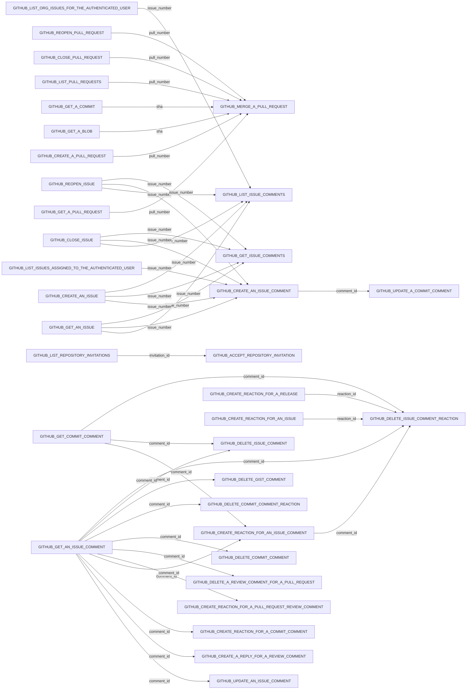

# Tool dependency graph

Producer → consumer. Edge labels are identifier fields supplied by the producer.

```mermaid
flowchart LR
  GITHUB_GET_AN_ISSUE["GITHUB_GET_AN_ISSUE"] -->|issue_number| GITHUB_LIST_ISSUE_COMMENTS["GITHUB_LIST_ISSUE_COMMENTS"]
  GITHUB_GET_A_PULL_REQUEST["GITHUB_GET_A_PULL_REQUEST"] -->|pull_number| GITHUB_MERGE_A_PULL_REQUEST["GITHUB_MERGE_A_PULL_REQUEST"]
  GITHUB_CREATE_A_PULL_REQUEST["GITHUB_CREATE_A_PULL_REQUEST"] -->|pull_number| GITHUB_MERGE_A_PULL_REQUEST["GITHUB_MERGE_A_PULL_REQUEST"]
  GITHUB_GET_AN_ISSUE["GITHUB_GET_AN_ISSUE"] -->|issue_number| GITHUB_CREATE_AN_ISSUE_COMMENT["GITHUB_CREATE_AN_ISSUE_COMMENT"]
  GITHUB_GET_AN_ISSUE["GITHUB_GET_AN_ISSUE"] -->|issue_number| GITHUB_GET_ISSUE_COMMENTS["GITHUB_GET_ISSUE_COMMENTS"]
  GITHUB_LIST_REPOSITORY_INVITATIONS["GITHUB_LIST_REPOSITORY_INVITATIONS"] -->|invitation_id| GITHUB_ACCEPT_REPOSITORY_INVITATION["GITHUB_ACCEPT_REPOSITORY_INVITATION"]
  GITHUB_CREATE_AN_ISSUE["GITHUB_CREATE_AN_ISSUE"] -->|issue_number| GITHUB_CREATE_AN_ISSUE_COMMENT["GITHUB_CREATE_AN_ISSUE_COMMENT"]
  GITHUB_CREATE_AN_ISSUE["GITHUB_CREATE_AN_ISSUE"] -->|issue_number| GITHUB_GET_ISSUE_COMMENTS["GITHUB_GET_ISSUE_COMMENTS"]
  GITHUB_CLOSE_ISSUE["GITHUB_CLOSE_ISSUE"] -->|issue_number| GITHUB_LIST_ISSUE_COMMENTS["GITHUB_LIST_ISSUE_COMMENTS"]
  GITHUB_CREATE_AN_ISSUE["GITHUB_CREATE_AN_ISSUE"] -->|issue_number| GITHUB_LIST_ISSUE_COMMENTS["GITHUB_LIST_ISSUE_COMMENTS"]
  GITHUB_REOPEN_ISSUE["GITHUB_REOPEN_ISSUE"] -->|issue_number| GITHUB_LIST_ISSUE_COMMENTS["GITHUB_LIST_ISSUE_COMMENTS"]
  GITHUB_LIST_ORG_ISSUES_FOR_THE_AUTHENTICATED_USER["GITHUB_LIST_ORG_ISSUES_FOR_THE_AUTHENTICATED_USER"] -->|issue_number| GITHUB_LIST_ISSUE_COMMENTS["GITHUB_LIST_ISSUE_COMMENTS"]
  GITHUB_GET_A_BLOB["GITHUB_GET_A_BLOB"] -->|sha| GITHUB_MERGE_A_PULL_REQUEST["GITHUB_MERGE_A_PULL_REQUEST"]
  GITHUB_GET_A_COMMIT["GITHUB_GET_A_COMMIT"] -->|sha| GITHUB_MERGE_A_PULL_REQUEST["GITHUB_MERGE_A_PULL_REQUEST"]
  GITHUB_LIST_PULL_REQUESTS["GITHUB_LIST_PULL_REQUESTS"] -->|pull_number| GITHUB_MERGE_A_PULL_REQUEST["GITHUB_MERGE_A_PULL_REQUEST"]
  GITHUB_GET_AN_ISSUE_COMMENT["GITHUB_GET_AN_ISSUE_COMMENT"] -->|comment_id| GITHUB_UPDATE_AN_ISSUE_COMMENT["GITHUB_UPDATE_AN_ISSUE_COMMENT"]
  GITHUB_CLOSE_ISSUE["GITHUB_CLOSE_ISSUE"] -->|issue_number| GITHUB_CREATE_AN_ISSUE_COMMENT["GITHUB_CREATE_AN_ISSUE_COMMENT"]
  GITHUB_REOPEN_ISSUE["GITHUB_REOPEN_ISSUE"] -->|issue_number| GITHUB_CREATE_AN_ISSUE_COMMENT["GITHUB_CREATE_AN_ISSUE_COMMENT"]
  GITHUB_CREATE_REACTION_FOR_A_RELEASE["GITHUB_CREATE_REACTION_FOR_A_RELEASE"] -->|reaction_id| GITHUB_DELETE_ISSUE_COMMENT_REACTION["GITHUB_DELETE_ISSUE_COMMENT_REACTION"]
  GITHUB_CREATE_REACTION_FOR_AN_ISSUE["GITHUB_CREATE_REACTION_FOR_AN_ISSUE"] -->|reaction_id| GITHUB_DELETE_ISSUE_COMMENT_REACTION["GITHUB_DELETE_ISSUE_COMMENT_REACTION"]
  GITHUB_CLOSE_ISSUE["GITHUB_CLOSE_ISSUE"] -->|issue_number| GITHUB_GET_ISSUE_COMMENTS["GITHUB_GET_ISSUE_COMMENTS"]
  GITHUB_REOPEN_ISSUE["GITHUB_REOPEN_ISSUE"] -->|issue_number| GITHUB_GET_ISSUE_COMMENTS["GITHUB_GET_ISSUE_COMMENTS"]
  GITHUB_CLOSE_PULL_REQUEST["GITHUB_CLOSE_PULL_REQUEST"] -->|pull_number| GITHUB_MERGE_A_PULL_REQUEST["GITHUB_MERGE_A_PULL_REQUEST"]
  GITHUB_REOPEN_PULL_REQUEST["GITHUB_REOPEN_PULL_REQUEST"] -->|pull_number| GITHUB_MERGE_A_PULL_REQUEST["GITHUB_MERGE_A_PULL_REQUEST"]
  GITHUB_CREATE_AN_ISSUE_COMMENT["GITHUB_CREATE_AN_ISSUE_COMMENT"] -->|comment_id| GITHUB_UPDATE_A_COMMIT_COMMENT["GITHUB_UPDATE_A_COMMIT_COMMENT"]
  GITHUB_LIST_ISSUES_ASSIGNED_TO_THE_AUTHENTICATED_USER["GITHUB_LIST_ISSUES_ASSIGNED_TO_THE_AUTHENTICATED_USER"] -->|issue_number| GITHUB_CREATE_AN_ISSUE_COMMENT["GITHUB_CREATE_AN_ISSUE_COMMENT"]
  GITHUB_GET_AN_ISSUE_COMMENT["GITHUB_GET_AN_ISSUE_COMMENT"] -->|comment_id| GITHUB_CREATE_A_REPLY_FOR_A_REVIEW_COMMENT["GITHUB_CREATE_A_REPLY_FOR_A_REVIEW_COMMENT"]
  GITHUB_GET_AN_ISSUE_COMMENT["GITHUB_GET_AN_ISSUE_COMMENT"] -->|comment_id| GITHUB_CREATE_REACTION_FOR_A_COMMIT_COMMENT["GITHUB_CREATE_REACTION_FOR_A_COMMIT_COMMENT"]
  GITHUB_GET_AN_ISSUE_COMMENT["GITHUB_GET_AN_ISSUE_COMMENT"] -->|comment_id| GITHUB_CREATE_REACTION_FOR_AN_ISSUE_COMMENT["GITHUB_CREATE_REACTION_FOR_AN_ISSUE_COMMENT"]
  GITHUB_GET_COMMIT_COMMENT["GITHUB_GET_COMMIT_COMMENT"] -->|comment_id| GITHUB_CREATE_REACTION_FOR_AN_ISSUE_COMMENT["GITHUB_CREATE_REACTION_FOR_AN_ISSUE_COMMENT"]
  GITHUB_GET_AN_ISSUE_COMMENT["GITHUB_GET_AN_ISSUE_COMMENT"] -->|comment_id| GITHUB_CREATE_REACTION_FOR_A_PULL_REQUEST_REVIEW_COMMENT["GITHUB_CREATE_REACTION_FOR_A_PULL_REQUEST_REVIEW_COMMENT"]
  GITHUB_GET_AN_ISSUE_COMMENT["GITHUB_GET_AN_ISSUE_COMMENT"] -->|comment_id| GITHUB_DELETE_A_REVIEW_COMMENT_FOR_A_PULL_REQUEST["GITHUB_DELETE_A_REVIEW_COMMENT_FOR_A_PULL_REQUEST"]
  GITHUB_GET_AN_ISSUE_COMMENT["GITHUB_GET_AN_ISSUE_COMMENT"] -->|comment_id| GITHUB_DELETE_COMMIT_COMMENT["GITHUB_DELETE_COMMIT_COMMENT"]
  GITHUB_GET_AN_ISSUE_COMMENT["GITHUB_GET_AN_ISSUE_COMMENT"] -->|comment_id| GITHUB_DELETE_COMMIT_COMMENT_REACTION["GITHUB_DELETE_COMMIT_COMMENT_REACTION"]
  GITHUB_GET_AN_ISSUE_COMMENT["GITHUB_GET_AN_ISSUE_COMMENT"] -->|comment_id| GITHUB_DELETE_GIST_COMMENT["GITHUB_DELETE_GIST_COMMENT"]
  GITHUB_GET_AN_ISSUE_COMMENT["GITHUB_GET_AN_ISSUE_COMMENT"] -->|comment_id| GITHUB_DELETE_ISSUE_COMMENT["GITHUB_DELETE_ISSUE_COMMENT"]
  GITHUB_GET_COMMIT_COMMENT["GITHUB_GET_COMMIT_COMMENT"] -->|comment_id| GITHUB_DELETE_ISSUE_COMMENT["GITHUB_DELETE_ISSUE_COMMENT"]
  GITHUB_CREATE_REACTION_FOR_AN_ISSUE_COMMENT["GITHUB_CREATE_REACTION_FOR_AN_ISSUE_COMMENT"] -->|comment_id| GITHUB_DELETE_ISSUE_COMMENT_REACTION["GITHUB_DELETE_ISSUE_COMMENT_REACTION"]
  GITHUB_GET_AN_ISSUE_COMMENT["GITHUB_GET_AN_ISSUE_COMMENT"] -->|comment_id| GITHUB_DELETE_ISSUE_COMMENT_REACTION["GITHUB_DELETE_ISSUE_COMMENT_REACTION"]
  GITHUB_GET_COMMIT_COMMENT["GITHUB_GET_COMMIT_COMMENT"] -->|comment_id| GITHUB_DELETE_ISSUE_COMMENT_REACTION["GITHUB_DELETE_ISSUE_COMMENT_REACTION"]
```

Full graph: 893 nodes, 1806 edges. See visualization.html.